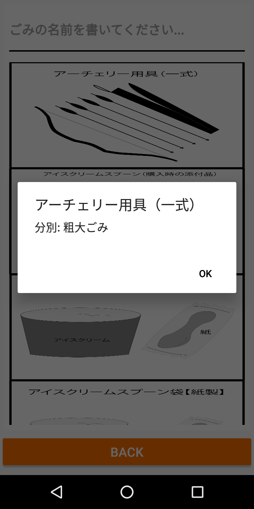
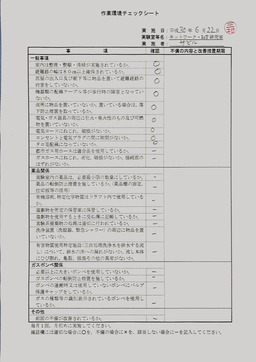

# Research Student Manual
For research students at Professor Zabir Laboratory.

# Table of Contents

   * [Research Student Manual](#research-student-manual)
      * [Introduction](#introduction)
   * [Things I wish I mastered](#things-i-wish-i-mastered)
      * [Git and GitHub](#git-and-github)
      * [Android Studio](#android-studio)
      * [Linux](#linux)
      * [Machine Learning](#machine-learning)
      * [Edge Computing](#edge-computing)
      * [Python](#python)
      * [Java](#java)
   * [Gomi Tatsujin - User’s app](#gomi-tatsujin---users-app)
      * [Prerequisite](#prerequisite)
      * [Setup](#setup)
      * [Demonstration Guide](#demonstration-guide)
         * [Calendar](#calendar)
         * [Garbage Classification Guide](#garbage-classification-guide)
         * [Garbage Stations](#garbage-stations)
   * [Gomi Tatsujin - Collector’s App](#gomi-tatsujin---collectors-app)
      * [Prerequisite](#prerequisite-1)
      * [Setup](#setup-1)
      * [Demonstration Guide](#demonstration-guide-1)
   * [IOT Kakashi](#iot-kakashi)
      * [Prerequisite](#prerequisite-2)
      * [Setup](#setup-2)
         * [Client](#client)
         * [Server](#server)
         * [Training Environment](#training-environment)
         * [Demonstration Guide](#demonstration-guide-2)
   * [FindMe](#findme)
      * [Prerequisite](#prerequisite-3)
      * [Setup](#setup-3)
         * [Raspberry Pi](#raspberry-pi)
      * [Demonstration Guide](#demonstration-guide-3)
   * [Smart Power Tap](#smart-power-tap)
      * [Prerequisite](#prerequisite-4)
      * [Demonstration Guide](#demonstration-guide-4)
   * [Other responsibilities](#other-responsibilities)
      * [Filling a form monthly](#filling-a-form-monthly)
      * [Disposing of garbage](#disposing-of-garbage)

## Introduction
	
Hello, my fellow students.

If you are reading this, I guess you need to get something done for the lab and you either have no idea where to start or how it would turn out. Rest assured! I am your predecessor and I know firsthand how confusing it can be.

This short ebook is mainly written based on my accumulated knowledge and experience during my one year stay at Professor Zabir laboratory, Tsuruoka National College. In which I have done several interesting projects encompassing many fields of studies including the Internet of Things, Machine Learning, Mobile Apps Development, and Edge Computing Research.

Some of the projects are continuation of our predecessors' works. Well, it is likely that you are also a computer science/engineering/information technology student, so you should know how difficult it can be continuing someone else works without proper documentation or assistant from the original creators. Hence, I create this manual to make your life of a research student a little less miserable. (Kidding, in truth it's not as hard as it sounds.)

Within this manual you can find:

* Background, inspiration, and objective of each project to give you some direction in your own development.
* Step by step guides to help you set up every project device, environment, and application.
* Instructions on how to demonstrate the projects to guests and visitors.
* GitHub repos for most projects.
* Some other information that you might find useful regarding working in the lab.

It is recommended to read the
 background/objective of the project first as it helps you understand why a particular project is conceived in the first place. 

But if you, for example, have to demonstrate the projects to the guests tomorrow and you are in a panic, it's okay skip directly to the omg-teach-me-how-to-setup-and-demonstrate parts. 

There are many projects and some can be time-consuming to set up, therefore, it is advisable to plan ahead.

Either you need my help or just stumble on this manual by accident, please acknowledge that you are one of the extraordinary people that read to the end of this section without skipping over it. 
I am truly grateful. 

Good luck on your research and enjoy your time in Tsuruoka.
Best wishes.

# Things I wish I mastered
	 
If by any chance, you become responsible for every project in the lab like me. (It was indeed the best thing! I learned a lot from taking care of all the stuff) The following are your best friends.

## Git and GitHub
	
[Git](https://git-scm.com/) technology and [GitHub](https://github.com/) is by far the best thing that was developed for humanity (Or every programmer). 

If you are not comfortable using Git by the time you graduate and have to work in industries, you will probably have trouble collaborating with your colleagues and working in general. 

Most of the projects in this manual are required and available on GitHub too. All the more to have a GitHub account, don’t you think so?

According to the [internet](https://git-scm.com/), 

>Git is a free and open source distributed version control system designed to handle everything from small to very large projects with speed and efficiency. Git is easy to learn and has a tiny footprint with lightning fast performance. 
    
Also according to the [internet](https://www.wikiwand.com/en/GitHub), 

>GitHub Inc. is a web-based hosting service for version control using Git. It is mostly used for computer code. It offers all of the distributed version control and source code management functionality of Git as well as adding its own features.

I use Git and GitHub extensively during my time here at the lab. Source version control like Git helps me maintain organized projects with clean development trees. I can create another branch to develop experimental feature. If that feature turns out to be messy, it won't affect my main, perfectly working fine, branch of development.

As I am responsible for working on several projects at the same time, I find myself constantly shifting my attention on those projects, with their own extensive code bases, all the time. GitHub helps me keep track of my progress on every project. Each repository commit has some description that remind me what have I done and what should I do next for the project. 

Moreover, GitHub ensures that I always have several back-ups all the time. I can’t count how many time I messed up the source code and have to roll back to the previous commit (version). Having good source version control also allow me to collaborate with others without messing up all the code.
	
Learn them. Use them a lot. And master them. Believe me, they are truly the programmer’s holy grail.

## Android Studio
	
Most of the projects in the lab implement Android to some extent. Thus, it’s no brainer to have Android Studio installed on your working computer if you are maintaining the projects. 

You can get the latest version of Android Studio from the [official website](https://developer.android.com/studio/). Or if you use Linux, you can install it via a package manager. Alternatively, you can also use Eclipse or IntelliJ. 

Personally, I think Android Studio is the best IDE for Android development so far. However, the best development tool is the one you are comfortable with. Some expert uses Vim and ADB for Android development.

## Linux
	
Many of the projects listed in this manual require more or less experience working with Linux. If you are not comfortable with Linux distros or Linux command, you can learn more about it on some of the sites [here](https://github.com/aleksandar-todorovic/awesome-linux). Linux is usually preferable in most IOT development stack. The popular IOT protoyping device Raspberry Pi run Raspbian by default.

## Internet of Things
	
According to the internet:

> Simply put, this is the concept of basically connecting any device with an on and off switch to the Internet (and/or to each other). This includes everything from cell phones, coffee makers, washing machines, headphones, lamps, wearable devices and almost anything else you can think of.  This also applies to components of machines, for example, a jet engine of an airplane or the drill of an oil rig. As I mentioned, if it has an on and off switch then chances are it can be a part of the IoT.  The analyst firm Gartner says that by 2020 there will be over 26 billion connected devices... That's a lot of connections (some even estimate this number to be much higher, over 100 billion).  The IoT is a giant network of connected "things" (which also includes people).  The relationship will be between people-people, people-things, and things-things.
	
If our lab is a Japanese restaurant, the Internet of Things is like our Sushi dishes. In the sense that it is our specialty and our main research area. 

## Machine Learning
	
According to the internet:

> Machine learning is an application of artificial intelligence (AI) that provides systems with the ability to automatically learn and improve from experience without being explicitly programmed. Machine learning focuses on the development of computer programs that can access data and use it to learn for themselves.
> 
> The process of learning begins with observations or data, such as examples, direct experience, or instruction, in order to look for patterns in data and make better decisions in the future based on the examples that we provide. The primary aim is to allow the computers to learn automatically without human intervention or assistance and adjust actions accordingly.

Machine learning is the foundation of cool many stuff ranging from Google search engine to Deepmind dominant AlphaGO. This has become one of the most beautiful term to put in skill section your CV so far. 

Even if you don't like mathematics nor statistics, learning how to implement a machine learning application with tools is always a good idea. You might want to start from [here](https://github.com/josephmisiti/awesome-machine-learning).

## Edge Computing
	
According to the internet:
	
>In the context of IIoT, 'edge' refers to the computing infrastructure that exists close to the sources of data, for example, industrial machines (e.g. wind turbine, magnetic resonance (MR) scanner, undersea blowout preventers), industrial controllers such as SCADA systems, and time series databases aggregating data from a variety of equipment and sensors. These edge computing devices typically reside away from the centralized computing available in the cloud.
>
> Wikipedia defines Edge Computing as “pushing the frontier of computing applications, data, and services away from centralized nodes to the logical extremes of a network. It enables analytics and data gathering to occur at the source of the data. This approach requires leveraging resources that may not be continuously connected to a network such as laptops, smartphones, tablets, and sensors.”
> 
>The role of edge computing to date has mostly been used to ingest, store, filter, and send data to cloud systems. We are at a point in time, however, where edge computing systems are packing more compute, storage, and analytic power to consume and act on the data at the machine location. This capability of edge computing will be more than valuable to industrial organizations—it will be indispensable.
	
Edge computing is sort of more relevant on the academic side of your research. But nonetheless an important part of our lab research. Everything about it is relatively new and you can write a bunch of research papers if you know your way around it. I'm not an expert on the topic myself, but if you are. You will be a gold research student here.

## Python

According to the internet:
> Python is an interpreted, object-oriented, high-level programming language with dynamic semantics. Its high-level built in data structures, combined with dynamic typing and dynamic binding, make it very attractive for Rapid Application Development, as well as for use as a scripting or glue language to connect existing components together. Python's simple, easy to learn syntax emphasizes readability and therefore reduces the cost of program maintenance. Python supports modules and packages, which encourages program modularity and code reuse. The Python interpreter and the extensive standard library are available in source or binary form without charge for all major platforms and can be freely distributed.
> 
> Often, programmers fall in love with Python because of the increased productivity it provides. Since there is no compilation step, the edit-test-debug cycle is incredibly fast. Debugging Python programs is easy: a bug or bad input will never cause a segmentation fault. Instead, when the interpreter discovers an error, it raises an exception. When the program doesn't catch the exception, the interpreter prints a stack trace. A source level debugger allows inspection of local and global variables, evaluation of arbitrary expressions, setting breakpoints, stepping through the code a line at a time, and so on. The debugger is written in Python itself, testifying to Python's introspective power. On the other hand, often the quickest way to debug a program is to add a few print statements to the source: the fast edit-test-debug cycle makes this simple approach very effective.

I use Python extensively in my projects. It is especially useful with ML and IOT related projects. Additionally, I also use it for every scripting task ranging from managing files and directories to writing graphs and figures.

## Java

According to the internet:
>Java is a programming language in the tradition of C and C++. As a result, if you have any experience with C or C++, you’ll find yourself in familiar territory often as you learn the various features of Java.
One of the main reasons Java is so popular is its platform independence, which means that Java programs can be run on many different types of computers. 
> 
> A Java program runs on any computer with a Java Runtime Environment, also known as a JRE, installed. A JRE is available for almost every type of computer — PCs running Windows, Macintosh computers, Unix or Linux computers, huge mainframe computers, and even cell phones.
> 
>Java is inherently object-oriented, which means that Java programs are made up of programming elements called objects. Simply put, an object is a programming entity that represents either some real-world object or an abstract concept.
	
Believe me, I do not like Java any more than you do. It is not a bad programing language per se. But I and most people I know would prefer any alternative unless there is no choice. And in the real world, usually, there is NO choice. 

Java has been widely used by the industries for a long time. It is the foundation of many projects to the point that migrating to a better language is not worth it anymore.  You can either learn to program it or lose work opportunities.

# Gomi Tatsujin - User’s app

Gomi Tatsujin is a garbage disposal assistant system. 

There are two different versions for common users and garbage collectors. This section is about the user’s app which was developed first. 

The project was started by Juhani Koskinen, a Finnish student from 2017, during his three-month exchange program. Then later developed further by Joona Nieminen and Nitis Monburinon. 

The aim is to develop a simple and intuitive mobile application to assist locals/seniors/foreigners with all the complex garbage classification system in Japan. The app is currently available only on the Android platform. It utilizes Google Play services like Place and Map.

## Prerequisite

Intermediate computer programming knowledge is mandatory. Others than that knowing and having these kinds of stuff should make your life easier.
* Mobile application development.
* Intermediate Java or Kotlin for Android development. (The code base is currently all written with Java though).
* Basic PHP for web services that mostly relate to MySQL database connection.
* Basic knowledge of computer network and information technology.
* Basic knowledge of MySQL database management.

## Setup

Unless unexpected problems occur, the setup process for this project is pretty straightforward. As it only requires your PC running WIndow, OSX, or Linux and stable internet connection.

1. Get Android Studio if you don’t have it already, also get Git for your platform and setup Git environment.

2. 	Clone this GitHub repository using a command
		
		git clone https://github.com/boonitis/gomi-application.git
    
    Or any other Git clients you prefer.

3. And then open your Android Studio **File** -> **New** -> **Import Project then choose the cloned project folder**.
	
    Alternatively, you can open Android Studio and go to **File** -> **New** -> **Project from Version Control** -> **GitHub**. Then enter your GitHub username and password. Select the repository and hit clone.
	
    Android Studio should build the Gradle automatically and the project should be ready for your development. 
    
However, there might occur some problems caused by differences between your machine and my random weird stuff that happen usually with Android that nobody knows why they haven’t been solved yet. 
    
This is quite unpredictable but Android Studio error messages proved useful in my case. Consult Google and  Stack Overflow or email boonitis@gmail.com  if things are out of your hands.

## Demonstration Guide
Prior to any demonstration session, it is advisable to create testing accounts via the registration menu first. Each account registration process requires email verification. Noted that this application requires an internet connection to be fully functional. 

There are three main features that can be demonstrated.

### Calendar

Featuring schedules for garbage collection. With a reminder function that can be set up by users and later notify them of the upcoming garbage collection schedule. Here we use colored trash bag icons to distinguish each garbage type accordingly. There are back and next buttons that users can press to change the calendar month.

### Garbage Classification Guide

Featuring a simple and searchable guide for garbage classification. There are two main components here; a search box and garbage types list with names and images. When user search the list will display relevant garbage types accordingly. 

Users can press at any garbage image and it will show information regarding how to classify that particular garbage type. 

**Note:** some of the garbage types don not have corresponding images, in this case, only names are shown.

### Garbage Stations

Featuring a map layout that displays garbage station locations in the area. Each garbage station has its collection status display by colors - green for collected - orange for not collected. These collection statuses correspond to information from the database. 

Users can also change current location use *Change Location* button. Location can be set manually or using GPS.

The collectors have their own apps that can modify each garbage station collection status once it has been collected. Users can tap to at the pin to show more information.

This feature provides users with enough information to plan their garbage disposal strategy. 
For example, some users' houses are far away from their garbage stations. If they are too late for garbage collection on a particular day, they can check via the app and decide to postpone disposing garbage instead of wasting their time for nothing.

# Gomi Tatsujin - Collector’s App

Gomi Tatsujin is a garbage disposal assistant system. There are two different versions for common users and garbage collectors. This section is about the collector’s app which was developed later in 2018 by Nitis Monburinon. 

The objective is to provide a sophisticated tool for garbage collectors. In conjunction with the user’s app, we want to provide a unified service that helps people in Tsuruoka and Japan, in general, have an easier time processing their household garbage. 

The app is currently available only on the Android platform. It utilizes Google Play services like Place and Map.

## Prerequisite

Intermediate computer programming knowledge is mandatory. Others than that knowing and having these stuff should make your life easier.

* Mobile application development.
* Intermediate Java or Kotlin for Android development. (The code base is currently all written with Java though).
* Basic PHP for web services that mostly relate to MySQL database connection.
* Basic knowledge of computer network and information technology.
* Basic knowledge of MySQL database management.

## Setup

Unless unexpected problems occur, the setup process for this project is pretty straightforward. As it only requires your PC running Window, OSX, or Linux and stable internet connection.

1. Get Android Studio if you don’t have it already, also get Git for your platform and set up Git environment as mentioned in the prerequisite section.

2. Clone this GitHub repository using a command

		git clone https://github.com/boonitis/gomi-collector.git
	
    Or any other Git clients you prefer.

3. And then open your Android Studio **File** -> **New** -> **Import Project then choose the cloned project folder**.
	
    Alternatively, you can open Android Studio and go to **File** -> **New** -> **Project from Version Control** -> **GitHub**. Then enter your GitHub username and password. Select the repository and hit clone.

	Android Studio should build the Gradle automatically and the project should be ready for your development.
    
However, there might occur some problems caused by differences between your machine and my random weird stuff that happen usually with Android that nobody knows why they haven’t been solved yet. 
This is quite unpredictable but Android Studio error messages proved useful in my case. 
Consult Google and  Stack Overflow or email boonitis@gmail.com  if things are out of your hands.

## Demonstration Guide

Prior to any demonstration session, it is advisable to create testing accounts via the registration menu first. 

Each garbage collector account requires a registration code from the administration database. Noted that this application requires an internet connection to be fully functional. 

Aside from the login and registration activities, the only part garbage collectors will interact with is the main MapActivity. 

Each garbage stations are represented by map markers with two different color denoted collections status of each garbage station. **Green** - denoted that a particular station has been collected. **Orange** - denoted that a particular station has NOT been collected yet. 

You can let the guests or the visitors press any marker. This will pop up a dialog with **Collect** button. Press **Collect** to modify the station collection status which will send data to the database. 

Then you can prove that the collection status has changed by showing them the Garbage Station feature from the user’s app. 

At the current state, this app hardly does anything else so that concludes the presentation.

# IOT Kakashi  

IOT Kakashi, also known as Kakashi or Smart Scarecrow, is an animal image recognition service that aims to help farmers prevent an animal invasion on theigit clone https://github.com/boonitis/gomi-application.gitr crops using an affordable and effective AI technology. 

It is one of the most advanced research project featured in this manual so far. Utilizing knowledge of the Internet of Things, Machine Learning, Computer Vision, Edge Computing, and Electronic to create a Raspberry Pi-powered IoT device that can capture animal images and recognize animal types. 

The project was initially developed in 2017 by three students from Thai-Nichi Institute of Technology Charat Khamsaeng, Pongsakorn Yoosook, and Suppachok Kiatikitikul. 

Then in 2018 redesigned and continued by Nitis Monburinon and Natthasak Vejprasit. 

Many parts of the system were changed during the course of two years of development. So this manual will mainly consist of 2018 version related information. The 2017 version manual is not relevant anymore as the current 2018 version is fundamentally different at almost everything. Some major differences are described below.

Element | 2017 Kakashi | 2018 Kakashi
------- | ------------- | -----------
Client Device | Raspberry Pi | Raspberry Pi
Client OS | Raspbian | Android Things
Client programming language | Python | Java
Server scripting language | PHP | Also PHP but Laravel
Recognition Engine | Clarifai | A custom made Kakashi  Recognition System by Nitis Monburinon
Recognition process occurs | Externally | Locally
 
## Prerequisite

Intermediate computer programming knowledge is mandatory. Others than that knowing the following subjects are highly recommended.

* Android application development, Android Thing to be specific but it’s very similar anyway.
* Prior experience working with microcontrollers such as Arduino and Raspberry Pi. As well as common sensor modules.
* Fundamental knowledge of electronic engineering.
* Internet of Things concept in general.
* Computer vision and image processing concept.
* Intermediate machine learning, both theory, and application is recommended. The main subject includes image data preparation, image classification, convolutional neural network, and TensorFlow.
* PHP for server-side scripting.
* Python and Tensorflow for training the recognition engine and data preparation.

The following electronic components are essential. You can find most of them scattered around the lab. If any of them is missing, you need to ask our supervisor to buy a new one or come up with alternative yourself.

* A working, not broken, Raspberry Pi. Also, its power supply adapter.
* A micro sd card for installing OS.
* A reliable PIR Sensor module. (This require some testing at first)
* A Raspberry PI camera module and its flex cable for the serial interface. (Sadly, they are not always together)
* At least 6 male-to-female jumper cables.
* A breadboard, a small circuit board for prototyping. 

## Setup

Due to the complexity of the setup process, I’ll divide the process into three subsections: Client, Server, and Training Environment.

### Client

1. Firstly, get every component from the previous requisite section from the lab. If any of them aren’t working, contact our supervisor ASAP. 

2. Absolutely do NOT power Pi during this step, for your own and device safety. Following a schematic diagram, connect all the components to GPIO pins with jumpers.

3. Follow the instruction on Android Thing documentation, setup Android Things on your Raspberry Pi. During this process, take note of your device’s IP address. (This is important in the later step)

4. On your PC, download Android Studio and Android Debug Bridge (ADB).

5. Clone this repository using this command.
	
    	git clone https://github.com/boonitis/kakashi-android.git

	Or any other Git clients you prefer.

6. And then open your Android Studio **File** -> **New** -> **Import Project then choose the cloned project folder**.
	
    Alternatively, you can open Android Studio and go to **File** -> **New** -> **Project from Version Control** -> **GitHub**. Then enter your GitHub username and password. Select the repository and hit clone.

7. Open the terminal. Using this command, connect your computer to Raspberry Pi via adb

		adb connect [your Pi IP address]

8. On Android Studio, click the app module in the Project window then select **Run** -> **Run** and select Google IOT Pi as your deployment target.

9. After the installation process, the Android Things OS should run the app automatically. Test functionality of PIR Sensor module, Pi Camera, and a recognition engine.

### Server
	
	To be added

### Training Environment

This step is optional. Only if you’re interested in training a new recognition engine by yourself.

1. On your PC, open the terminal and clone this repository using a command

		git clone https://github.com/boonitis/kakashi-modelling.git
	
    Or any other Git clients you prefer.

2. Go to the cloned directory, run the following to install all the requirement.

		bash install_requirement.sh
	
3. In addition to content from the cloned repository. You also need to download training dataset separately. Due to how GIT works I couldn’t possibly put the training data in the repo.

4.  Organize training image data into different directories, based on their classes. For example, put all monkey images in /monkey and put all human images in /people

5. Put all the training data directories in ./tf_files/training_photos. 

6. Resize training data to 224x224 using the following command

		bash image-batch-resizer.sh

7. Start the training process using

		bash train.sh

	Wait until the process complete.

8. Test your model performance using 

	bash run.sh [/path/to/test_image]

### Demonstration Guide

Prior to any demonstration session, you have to prepare and print the required animal pictures. Then connect a display to Raspberry Pi using HDMI. 

Power up the Pi and the app should be ready in a moment. Hover any picture in front of the camera and PIR Sensor will detect it automatically. 

Results will appear on the monitor. 

Since this is a quite complex system, please test all the functionalities thoroughly to avoid unexpected bugs and failures during a demonstration session.

# FindMe  

FindMe is a smart status indicator system created with Raspberry Pi and E-ink display. The project started in mid-August 2018 by Nitis Monburinon. The project is named by Prof. Zabir later and has become a regular project that we show to lab visitors presented during our demonstration session.

In Japan, usually, lecturers and researchers have customs to use something like whiteboard or paper to indicate their statuses in their workplaces. 

These indicators tell their visitors whether the lecturers are available or not. Are lecturers at lunch or having meetings? 

Are they home or working overtime? Visitors can tell by looking at indicators in front of the lecturers’ places.  

This system very useful in many situations and we thought we could improve its usefulness further by adding IOT and E-Ink technology to it. 

> Electronic ink technology produces a low-power paperlike display used primarily in early e-book readers such as Amazon's Kindle. Initial research on e-ink started at MIT's Media Lab, where the first patent was filed in 1996. 
The rights to the proprietary technology currently are owned by the Massachusetts-based E Ink Corporation, which was acquired by Taiwanese company Prime View International in 2009. E-ink technology in early e-readers works by using tiny microcapsules that are suspended in a liquid placed within a film layer. The microcapsules, which are about the same width as human hair, contain both positively charged white particles and negatively charged black particles. Applying a negative electrical field causes the white particles to come to the surface. Conversely, applying a positive electrical field causes the black particles to come to the surface. By applying different fields at various parts of a screen, e-ink produces a text display. E-ink displays are especially popular due to their resemblance to printed paper. Besides being considered by many as easier on the eyes than other display types, e-ink also boasts lower power consumption, particularly when compared to traditional backlit liquid crystal display (LCD) screens. 
Considering all the advantage E-ink displays provide, we adopt the technology in our FindMe project. FindMe can be deployed in front of any workplace or office. Users can use an Android mobile application to send messages to it from anywhere. 

As the display only refresh once it receives messages, power consumption is low. 

FindMe keeps texts on the display for a long time even when it’s not powered. This is useful when power is unavailable.

The E-ink display has its own low-level library written in C. But I have developed a high-level API that easily understandable using Python. 

At the current state, English, Japanese, and Thai were tested and proved to work correctly on the display.

## Prerequisite

Intermediate computer programming knowledge is mandatory. Others than that knowing the following subjects are highly recommended.
* Python for microcontroller programming.
* Java for Android application development.
* Prior experience working with a microcontroller such as Arduino and Raspberry Pi. As well as common sensor modules.
* Fundamental knowledge of electronic engineering. 
* Internet of Things concept in general.

The following electronic components are essential. You can find most of them scattered around the lab. If any of them is missing, you need to ask our supervisor to buy a new one or come up with alternative yourself.
* A working, not broken, Raspberry Pi. Also, its power supply adapter.
* A micro sd card for installing OS.
* An E-Ink display. 

## Setup

### Raspberry Pi

Firstly, get everything from the previous section from the lab. If any of them aren’t working, contact our supervisor ASAP. 

1. Absolutely don’t power Pi during this step, for your own and device safety. Attach E-ink display directly on the Pi, as shown in the figure.

2. Open the terminal, run this command to open raspberry pi configuration menu.

      sudo raspi-config
   
   Here you need to enable SPI by selecting **Inferfacing Options** => **P4 SPI** then hit **Yes**

3. Go to $HOME directory, clone the E-ink display API repository using a command.

      cd ~
		git clone https://github.com/boonitis/findme-client.git

4. Get into the cloned directory. Run install_requirement.sh to install dependencies.

      cd findme-client
      bash install_requirement.sh

5. Using sudo privilage, copy  findme.service to the systemd service directoriy.

      sudo cp findme.service /etc/systemd/system/

6. Copy findme-helper.sh to the $HOME directory.
   
      cp findme-helper.sh ~

7. Run the following command to setup autostart service that will run app.py as a daemon when this Pi is booted.
   
      sudo systemctl daemon-reload
      sudo systemctl start findme
      sudo systemctl enable findme

8. Confirm whether the daemon (service) is working by rebooting the device and run this command.

      sudo systemctl status findme
    
### Android Application

1.	On your PC, download Android Studio and Android Debug Bridge (adb)
	clone this repository using a command

		git clone https://github.com/boonitis/find-me.git
        
	And then open your Android Studio **File** -> **New** -> **Import Project** then choose the cloned project folder.

1. Connect your smartphone to your PC using a USB cable.

2. In Android Studio, click the app module in the Project window then select Run -> Run and select [Your device name] as your deployment target.

3. After the installation process, look for the FindMe app on your smartphone. Try sending a message to the Raspberry Pi.

## Demonstration Guide

You can let the users type a message and send to the display. When you explain how E-ink display consumes very little power consumption, try unplugging Raspberry Pi and show that E-ink display retains all the text even without electricity. I tried it, and I think it was quite impressive. 

I guess that all it is for FindMe. 

# Smart Power Tap

Smart Power Tap is a smart power outlet created with Arduino Uno Wifi connected to an electrical outlet. This allows the outlet, and any device connected to it, to be controlled wirelessly via a mobile application. 

The project was originally developed by a French student Archour Zackaria (2017). 

He also wrote a very thorough document which can be found here. All the right and credits belong to him.

## Prerequisite

Intermediate computer programming knowledge is mandatory. Others than that knowing the following subjects are highly recommended.
* C++ for Arduino.
* Prior experience working with a microcontroller such as Arduino and Raspberry Pi.
* Fundamental knowledge of electronic engineering. 
* Internet of Things concept in general.

The following electronic components are essential. You can find most of them scattered around the lab. If any of them is missing, you need to ask our supervisor to buy a new one or come up with alternative yourself.

* An Arduino Uno Wifi. Also, its power supply adapter.
* A power outlet.
* Several jumpers.
* Any electric device to be connected to the power outlet. Something easily noticeable like a lamp is preferred.

## Demonstration Guide
You can let people use the app to control Smart Power Tap directly. It’s better if they interact with the app themselves.

# Other responsibilities
	
As I am a long term student, I have become the power that Prof. Zabir wields (I didn't make this up, he actually said it). If you are also a long term student, chances are that you also have more responsibilities other than finishing your research project to attend to. 

The purpose of this section is to pass on my knowledge regarding these responsibilities that I’ve learned so far.

## Filling a form monthly
	
This is sort of a form that every laboratory required to fill monthly. It is all in Japanese but it’s not that complex. You write the date on the top left. The lab name below. Then, following the example, fill all the box with circles (O) and hyphen (-). Done.

## Disposing of garbage

There are some trash cans in the lab. When any of it is full you can ask your tutor to help you throw it away and replace it. 

Last time I organized the lab, I put trash bags in this locker with a little post-it note.

Garbage classification in the lab use different system from normal garbage classification.

Brown bags is for burnable garbage only.
The rest goes into plastic bags.

There are three different trash cans in our lab.
1. Burnable waste.
2. PET bottles (Remove caps and labels). 
3. Incombustible. (Plastic bottle caps and labels go here).

Laborartory garbage have to be put in a specific place in the kosen. You cannot dispose it outside the kosen. For that you have to follow Tsuruoka City Garbage Classification Guide issued by the city hall.

Got to keep the working environment clean for yourself and others, right?

# Collabotators and members of the lab

I thought it might be useful to have a single place that contains information about people in the lab or people that worked here. In case you have inquiry regarding their respective projects. Something that I forget to mention in this manual and you want to ask the original developer yourself. Please remember that they might be busy at time as they have their own stuff to take care of now. Thanks me later :)

## Salim Zabir

## Nitis Monburion

## Juhani

## Joona

## Arnaud

## Zach

## Nathasak Vejprasit
